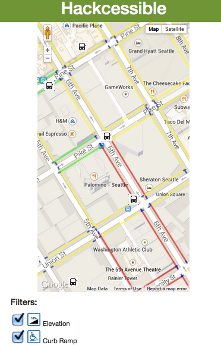

# Hack the Commute: Bus Stop Accessibility

This app is developed to help people who use wheelchairs plan their routes in Seattle, taking into account their specific accessibility needs. It can be used as an extention to OneBusAway application or as a separate tool.

Today, the app allows users to check the terrain around the bus stop for accessibility issues, report obstacles and verify information contribued by other users. The future goal is to allow users to search for an accesible route based on their preferences.

Our app is live at [http://hackcessible.herokuapp.com/](http://hackcessible.herokuapp.com/).

Here's a pretty picture:

## Challenge and Approach

Our submission is for [Challenge #2: Improve the commuter experience in any single mode](http://tmpl.at/1EykAbV).

Today, a person in a wheelchair does not have a full or unified access to up-to-date information about upgraded ramp curbs, sidewalk closures, road construction, steep hills or other obtacles that can block their mobility.

We believe that every person in Seattle should enjoy freedom and convenience of commuting.

**Design question**:

_How can we help people who use wheelchairs find routes tailored to their needs? How can we improve their commute experience in Seattle?_

Our approach for satisfying this challenge was to:

- Determine obstacles faced by people in wheelchairs when navigating their commute
- Create a design schema to easily convey obstacles to users
- Enhance information available in OneBusAway using open data sets
- Allow community reporting to improve adaptability and increase data size

Once we did that, we knew we could make a change for someone's life!

## Team Members

Our team is comprised of:

- [@AllieDeford](https://github.com/AllieDeford) - Queen of Juggling All The Things! (a.k.a. Project Manager) and dev
- [@nbolten](https://github.com/nbolten) - Supreme Overlord of Flask, virtual environments, and data manipulation. Super Coder (tm)
- [@Reagankm](https://github.com/Reagankm) - Web dev novice but the kid's got heart
- [@versipan](https://github.com/versipan) - User Advocate and all-around design expert

## Technologies, APIs, and Datasets Utilized

We made use of:

- Python, Flask server, JavaScript, CSS, HTML 5
- [Sidewalk Data Set](https://data.seattle.gov/Transportation/SDOT-Sidewalks/pxgh-b4sz) from City of Seattle Department of Transportation: curb and sidewalk data
- [Google Maps Elevation API](https://developers.google.com/maps/documentation/elevation/): elevation data)
- [One Bus Away API](http://pugetsound.onebusaway.org/p/OneBusAwayApiService.action): bus stop information

## Contributing

#### Installation and Setup
Hackcessible is based on the Flask web framework using python 2.7. A list of pip-installable requirements is listed in requirements.txt and include:
* Flask >= 0.10
* Flask-WTF >= 0.11
* Flask-SQLAlchemy >= 2.0
* gunicorn >= 19.0
* requests >= 2.6.0

To run the app:
1. Set a Mapbox API Token, OneBusAway API Key, and the location of the hackcessibleapi site. These can be defined either as environment variables or as config variables of the same name in instance/config.py (the latter will take precedence - if both environment variables and the config are present, the config's values are used). The variables have these titles:
    MAPBOX_TOKEN
    OBA_KEY
    API_URL
2. Get the elevation and sidewalk data. To save on bandwidth, requests, and client-side computation, we do not query Google Maps or the SDOT data set on the client side (javascript) and instead store the preprocessed data on the server. It is currently not tracked in git and must be downloaded separately (contact one of the contributors to get it). We are quickly moving to having a RESTful API to make accessing the data easier.
3. Run `python app.py`. This will use the Werkzeug server, which should not be used in production. We do not currently use gunicorn (as much is in flux), but will do so in the future.

#### Using the website

1. Visit [http://hackcessible.herokuapp.com/](http://hackcessible.herokuapp.com/)
2. Enter a bus stop number or click "Show Map of Current Location"
3. Use the filters at the bottom of the page to select the obstacles you wish to see
4. Longpress (click and hold without moving the mouse to report a new obstacle

Our code is licensed under the [MIT License](LICENSE.md). Pull requests will be accepted to this repo, pending review and approval.
